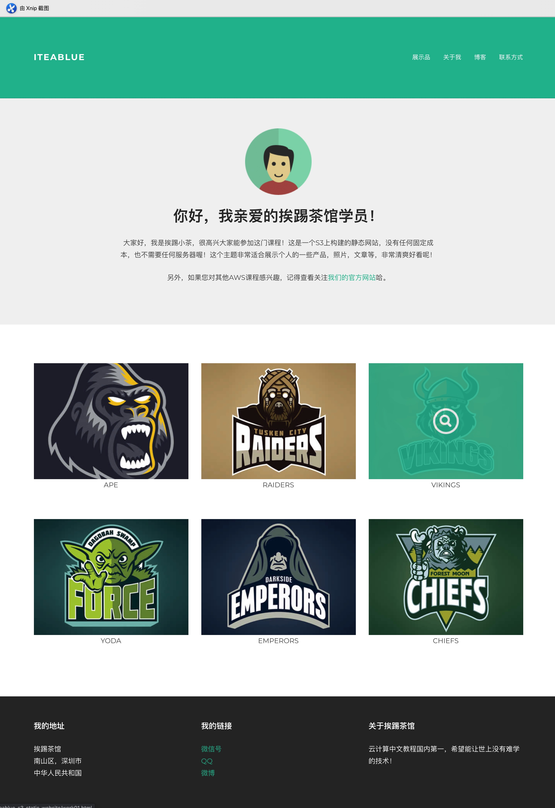

# S3 静态网站托管页面

这是一个由静态文件组成的一个静态网站，可以当作一个个人博客，展示作品的页面。全部内容由css,js,html和图片组成，全部文件是静态文件，可以直接托管在亚马逊AWS S3服务智商，也可以集成CDN服务进行内容分发，加速和缓存。

此代码作为挨踢茶馆云计算的[《AWS 认证解决方案架构师》](https://iteablue.com/course/aws-certified-solutions-architect-associate) 课程的实验部分提供。

# 效果
以下为网站的效果图：

